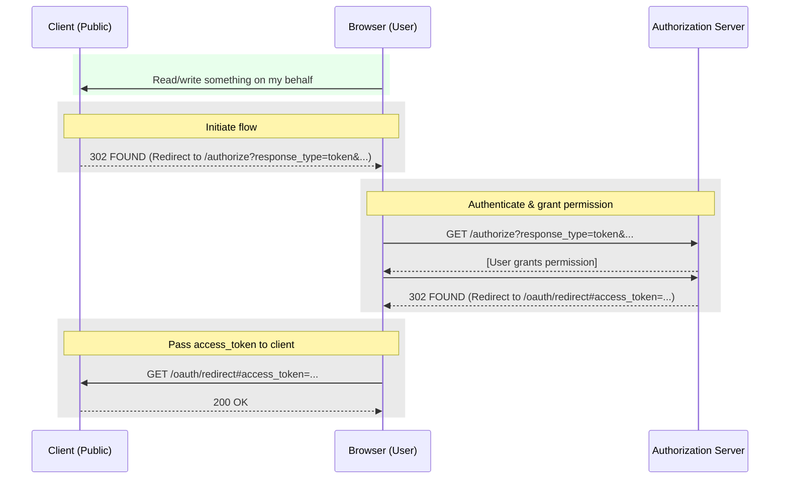

# Implicit Grant Type

- Typically used for browser-based apps (SPAs) or mobile apps
- Access token is **NOT** sent to the client app's server (part of the url fragment)
- Browser must be able to execute JavaScript
- Less secure: access token can potentially be exposed in browser history or logs since it is passed via the URL fragment.
- Does not support refresh tokens

