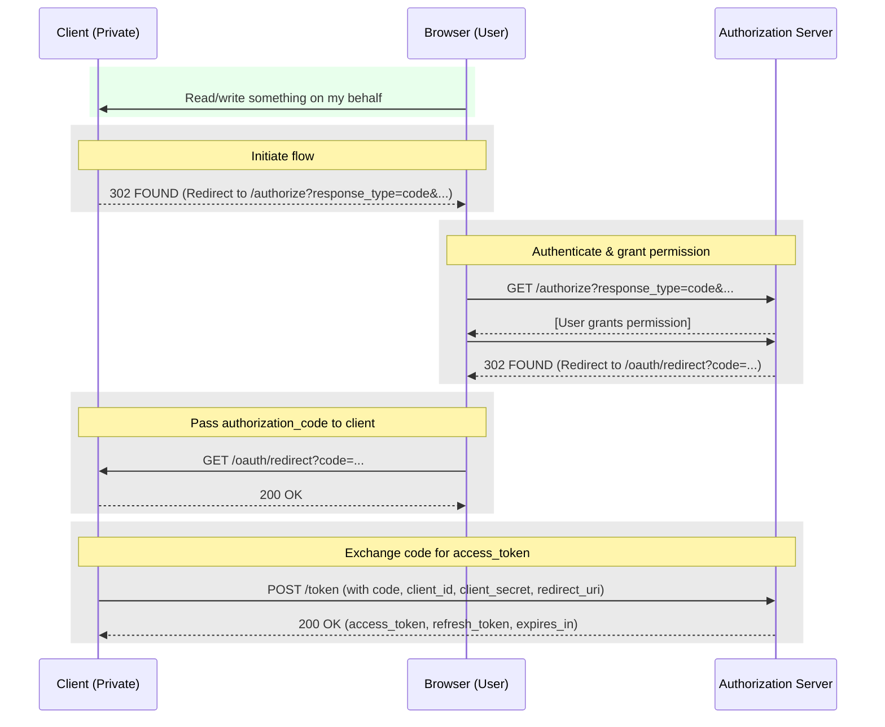

# Authorization Code Grant Type

- More secure than the implicit grant type.
- Typically used for **server-side web apps**, since it requires a client secret (effectively the client's password for the authorization server).
- Not useful for browser-based apps (SPAs) since the client secret cannot be stored securely.
- Not useful for native apps (mobile apps, desktop apps, etc.) since the client secret cannot be stored securely.

