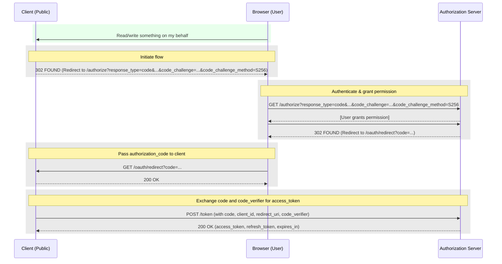

# Authorization Code Grant Type with PKCE

- More secure than the implicit grant type
- More secure than the authorization code grant type
- Recommended flow for browser-based apps (SPAs) where the client secret cannot be stored securely. (Instead of using the implicit grant type.)
- Can be used for native apps (mobile apps, desktop apps, etc.) where the client secret cannot be stored securely.
- Useful as a method to augment the Authorization Code Flow in general, becuase it can prevent authorization code interception attacks which is done by intercepting the authorization code and exchanging it for an access token.

