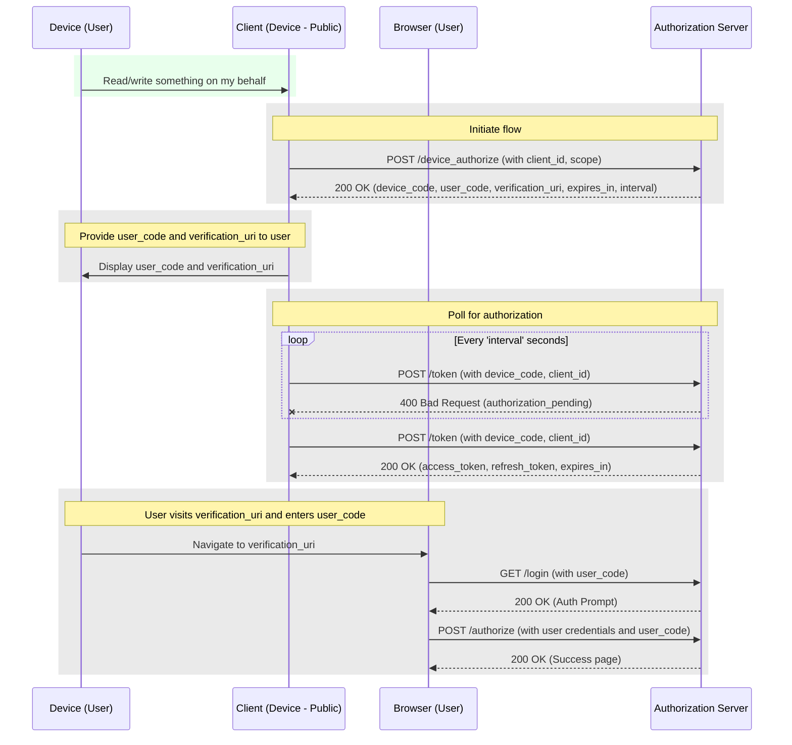

# Device Authorization Grant Type

- Typically used for devices that do not have an easy way to enter user credentials (e.g. smart TVs, game consoles, etc.)
- Also can be used for native apps (mobile apps, desktop apps, etc.) where the client secret cannot be stored securely.

