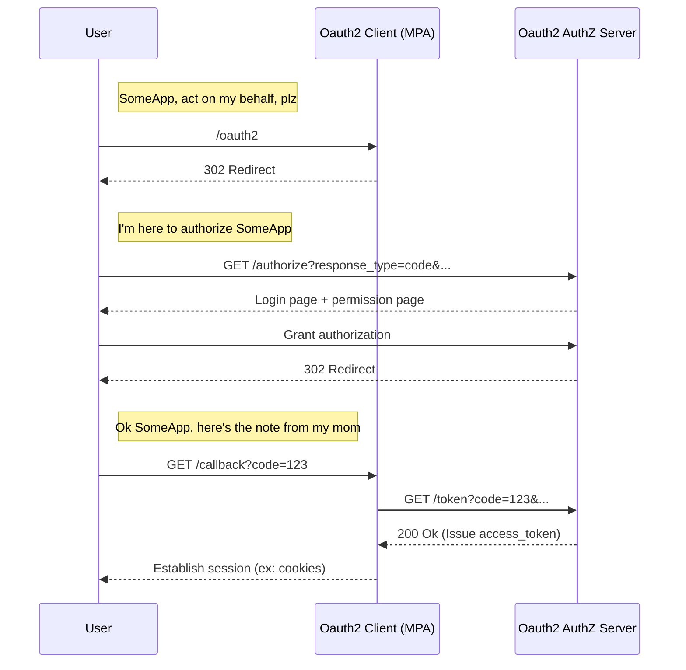

# Implicit Flow

```mermaid
sequenceDiagram
  %% client = server-rendered app? user -> client arrows are _actual_ requests
  %% client = SPA? user -> client arrows are more like button clicks/js reading state
  participant user as User
  participant client as Oauth2 Client (MPA)
  participant oauth as Oauth2 AuthZ Server

  rect rgba(255, 255, 255, 0.1)
    note right of user: SomeApp, act on my behalf, plz
    user ->> client: /oauth2
    client -->> user: 302 Redirect
  end

  rect rgba(255, 255, 255, 0.1)
    note right of user: I'm here to authorize SomeApp
    user ->> oauth: GET /authorize?response_type=code&...
    oauth -->> user: Login page + permission page
    user ->> oauth: Grant authorization
    oauth -->> user: 302 Redirect
  end

  rect rgba(255, 255, 255, 0.1)
    note right of user: Ok SomeApp, here's the note from my mom
    user ->> client: GET /callback?code=123
    client ->> oauth: GET /token?code=123&...
    oauth -->> client: 200 Ok (Issue access_token)
    client -->> user: Establish session (ex: cookies)
  end

```
