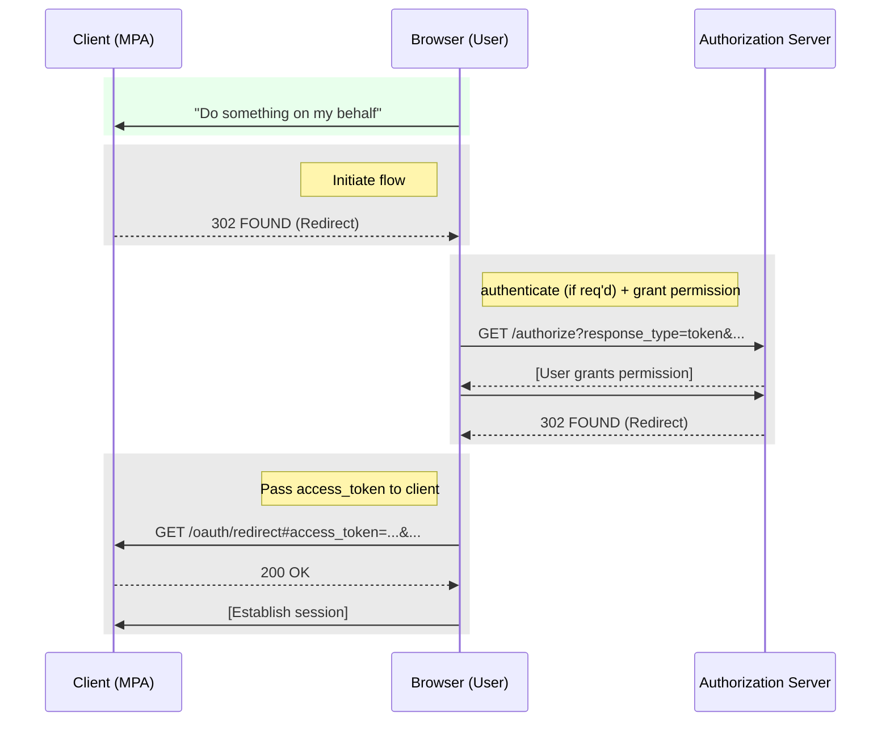

# Implicit Flow

```mermaid
%% Oauth2 goal: get client an access_token (+ maybe refresh_token + maybe id_token)

sequenceDiagram
  participant client as Client (MPA)
  participant browser as Browser (User) ## User-Agent + Resource Owner + Web-Hosted Client Resource
  participant authserver as Authorization Server

  rect rgb(140, 255, 160, 0.2)
    %% the user takes some action that requires the
    %% client to act on their behalf, and thus needing
    %% to get an access_token.
    browser ->> client: "Do something on my behalf"
  end

  rect rgba(150, 150, 150, 0.2)
    note left of browser: Initiate flow
    %% client constructs the authorization server URI
    %% and redirects the user-agent to that URI
    %% /authorize
    %%   ?response_type=token
    %%   &client_id=...         identifies the client app to the auth server
    %%   &redirect_uri=...      the registered location to redirect the client app to after the grant decision
    %%   &scope=...             the scopes/permissions the client app is requesting
    %%   &state=...             arbitrary state that the auth server will propagate back to the redirect_uri
    client -->> browser: 302 FOUND (Redirect)
  end

  rect rgba(150, 150, 150, 0.2)
    note right of browser: authenticate (if req'd) + grant permission

    %% user-agent makes the request to the authorization server
    browser ->> authserver: GET /authorize?response_type=token&...

    %% user decides whether to grant requested permissions
    authserver -->> browser: [User grants permission]
    browser ->> authserver: ;

    %% upon a decision, the auth server redirects to redirect_uri,
    %% with the access_token (and friends) in the url FRAGMENT
    %% /oauth/redirect
    %%   #access_token=...
    %%   &token_type=...
    %%   &expires_in=...
    %%   &state=...
    authserver -->> browser: 302 FOUND (Redirect)
  end


  rect rgba(150, 150, 150, 0.2)
    note left of browser: Pass access_token to client

    %% user-agent makes the request to the client (MPA)
    %% IMPORTANT: access_token is NOT sent to the client (MPA)
    %%            because it's in the fragment
    browser ->> client: GET /oauth/redirect#35;access_token=...&...

    %% client responds with html + js
    client -->> browser: 200 OK

    %% browser-side js reads the access_token and sends it
    %% to the client to initiate a "session" for the access_token
    browser ->> client: [Establish session]
  end
```
